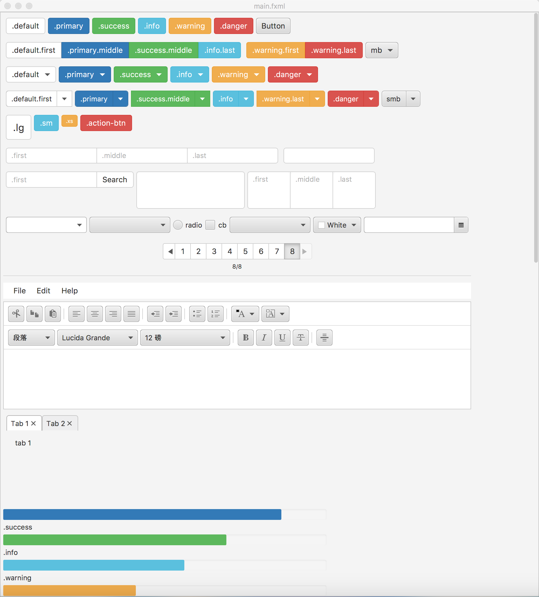
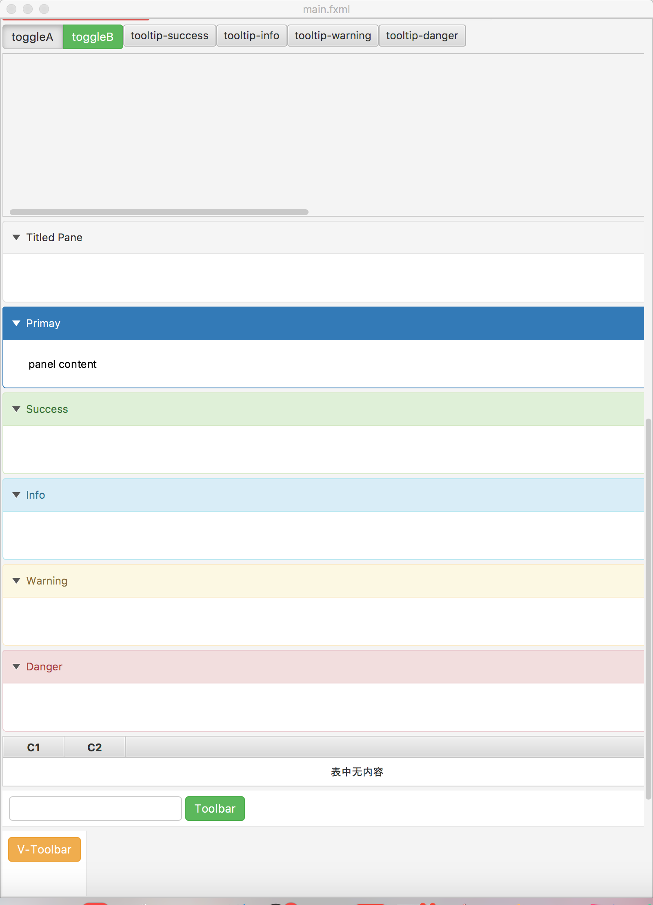
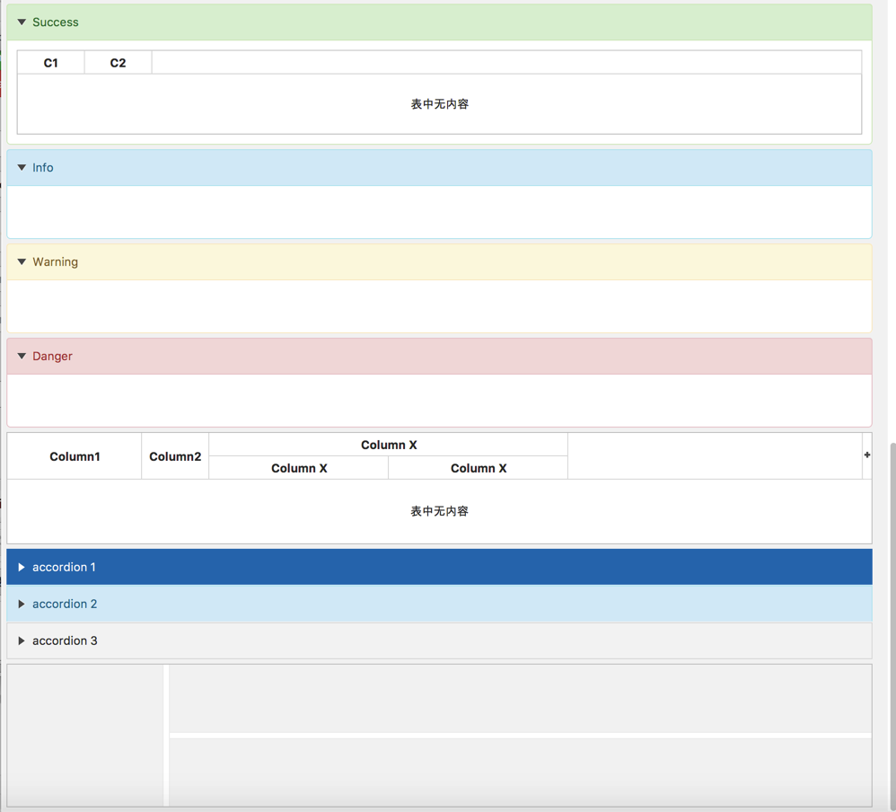

# jbootx
a javafx theme of bootstrap(3.x ver)

got annoyed with the default Modena theme of JavaFx8?
the bootstrap 3.x theme is very beautiful right?
no worry, jbootx is what u r lookin for!
have a look at it!

it's very easy to use! that means,no java code is required!

###involve the bootstrap.css to your project
~~~
scene.getStylesheets().add(Main.class.getResource("bootstrap.css").toExternalForm());
~~~
Enjoy your self!

##look into the main.fxml and learn how to use it!