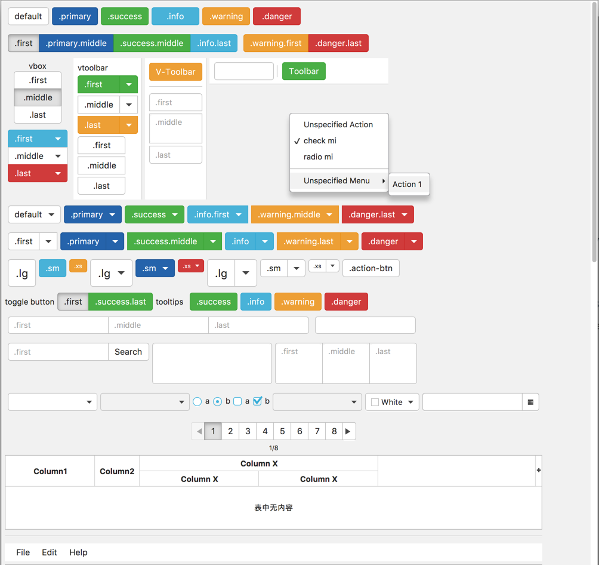
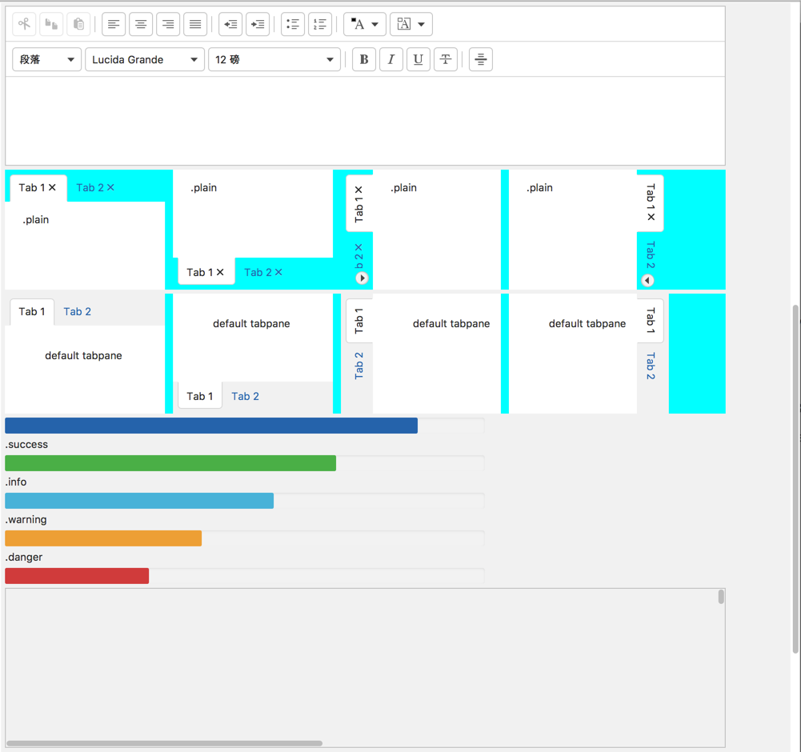
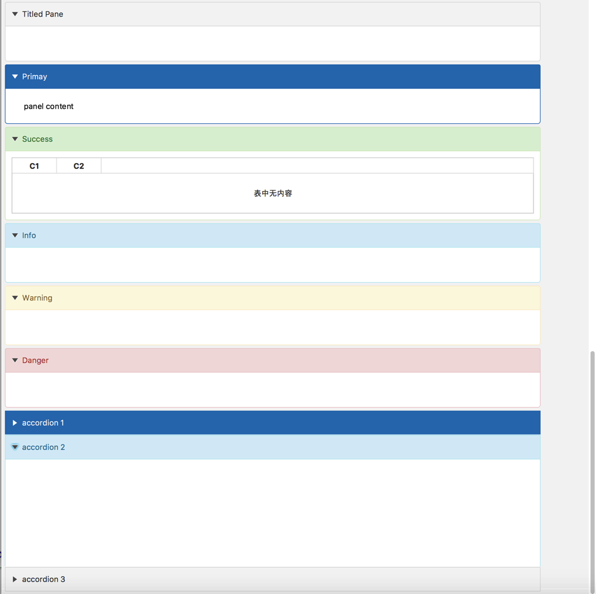
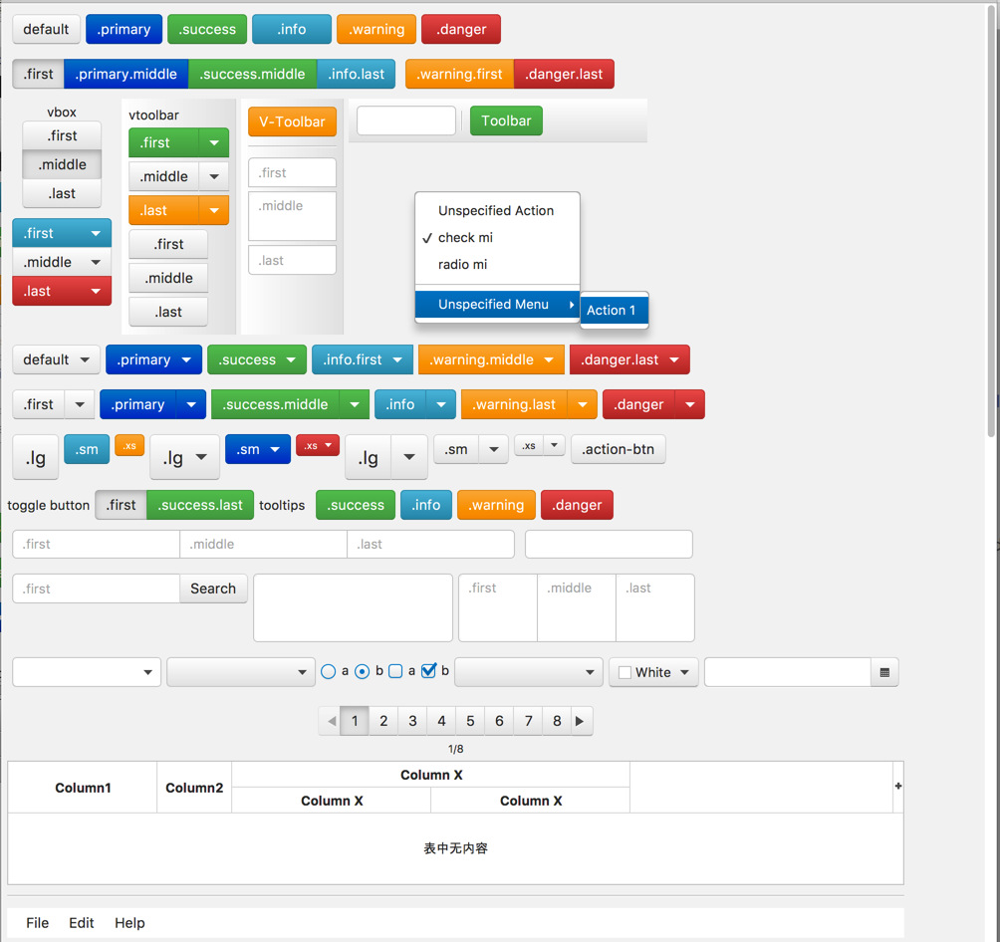
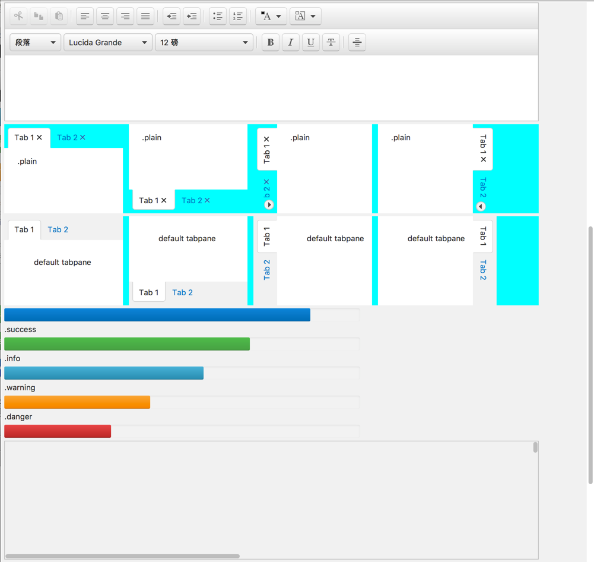
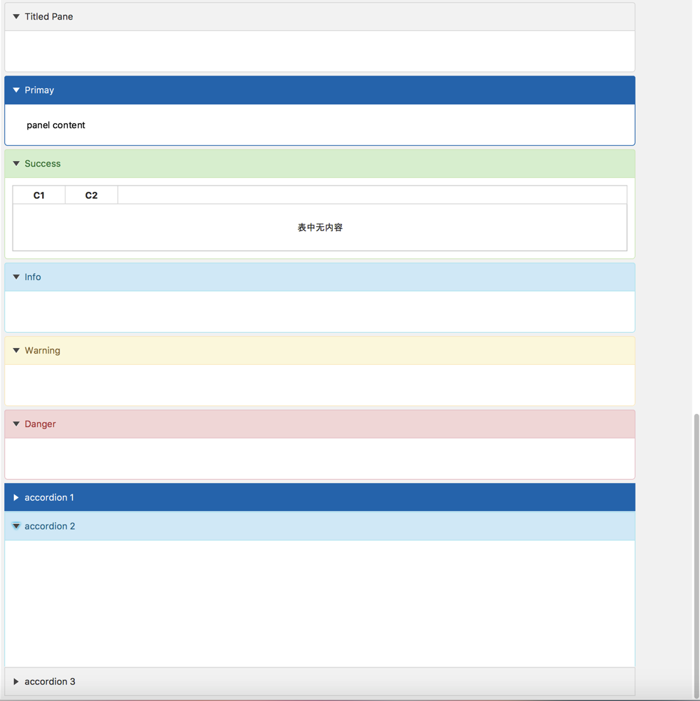

# jbootx
a javafx theme of bootstrap

got annoyed with the default Modena theme of JavaFx8?
the bootstrap 3.x theme is very beautiful right?
no worry, jbootx is what u r lookin for!
have a look at it!

#####requirement
do not switch to the *`caspian`* theme!

best experience in `Java8` environment

##Bootstrap3

it's very easy to use! that means,no java code is required!

###just involve the `bootstrap3.css` file in your project
~~~
scene.getStylesheets().add(Main.class.getResource("bootstrap3.css").toExternalForm());
~~~

####open the `bootstrap3overview.fxml` in your `Scene Builder` and learn how to use it!

-------
##Good news!bootstrap2 is also available!
##Bootstrap2

###import `bootstrap2.css` file to your project
~~~
scene.getStylesheets().add(Main.class.getResource("bootstrap2.css").toExternalForm());
~~~

####open the `bootstrap2overview.fxml` in your `Scene Builder` and learn how to use it!

Enjoy urself!